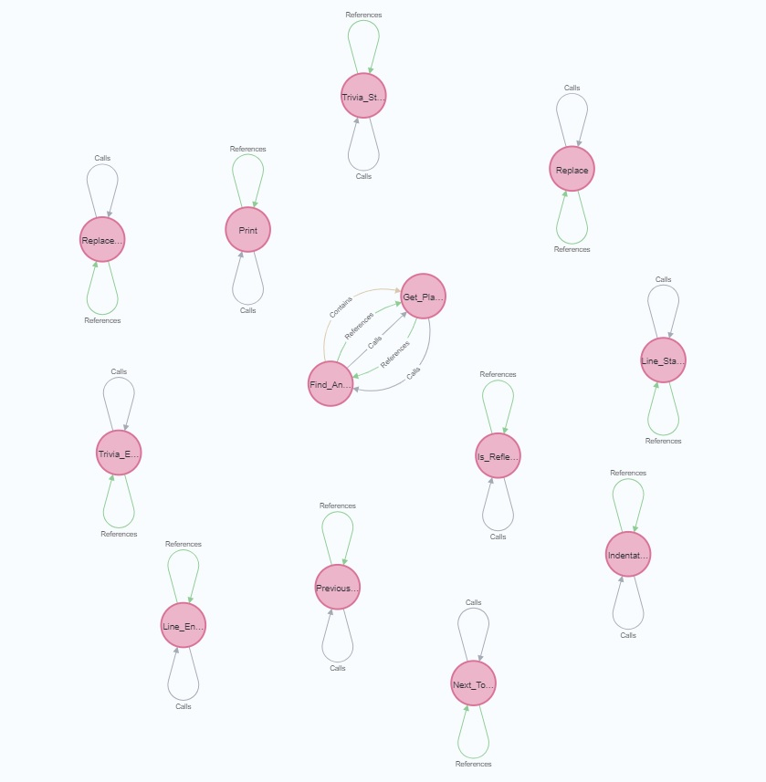
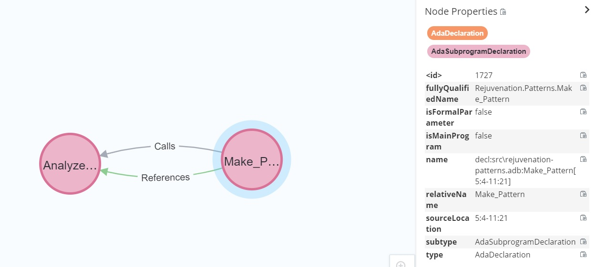

# Dependency Graph Extractor

The Dependency Graph Extractor generates a GraphML file with dependency information derived from the Ada source files contained within the given project files.

## Running

Run the Dependency Graph Extractor as follows:

```
dependency_graph_extractor.exe -o output.graphml [-p directory] project_1.gpr ... project_n.gpr

 -h, --help           Display help
 -o, --output=ARG     The output GraphML file
 -p, --prefix=ARG     Directory prefix stripped from the file names in the output graph
```

The output GraphML file is required, as is at least one GPR file. If the output GraphML file already exists, it will be overwritten.

Optionally, a directory prefix can be passed to the extractor using the `-p` option. When done so, the extractor removes the prefix from every filename in the generated GraphML file. Note that, if a filename does not start with the specified prefix, it wil occur in the GraphML file as-is.

Note. Although Dependency Graph Extractor can analyse multiple projects, it can't analyze an aggregate project with more than one sub-project.

### Example

Suppose we want to extract source code dependency information from the GPR project named `rejuvenation_lib.gpr`, 
which is located in `C:\path\to\Renaissance-Ada\src\libraries\Rejuvenation_Lib`.
Moreover, suppose we do not want have the `C:\path\to\Renaissance-Ada\src\libraries\Rejuvenation_Lib` prefix occurring in the generated GraphML file.
To achieve this, we can run the Dependency Graph Extractor as follows:

```cmd
dependency_graph_extractor.exe -o rejuvenation_lib.graphml -p C:\path\to\Renaissance-Ada\src\libraries\Rejuvenation_Lib C:\path\to\Renaissance-Ada\src\libraries\Rejuvenation_Lib\rejuvenation_lib.gpr
```

Note we assume that either `dependency_graph_extractor.exe` is on the system PATH 
or the current directory is the `obj` directory of the Dependency_Graph_Extractor project.

This will create the GraphML file `rejuvenation_lib.graphml` in the current directory.

## Usage
Open the generated `graphml` file with [Neo4j](https://neo4j.com) according to [the import instructions](https://neo4j.com/labs/apoc/4.1/import/graphml/).
Note, your cypher query should resemble
```cypher
CALL apoc.import.graphml("movies.graphml", {readLabels: true})
```

Prepare yourself by reading the [Node and Edge Types](Ada_Node_and_Edge_Types.docx?raw=true) present in the graph database.

You can now interactively query the graph database using [Cypher](https://neo4j.com/developer/cypher/).
For more info on [Cypher](https://neo4j.com/developer/cypher/), 
see the [Cypher resources](https://neo4j.com/developer/cypher/resources/), including the 
[Neo4j Cypher refcard](https://neo4j.com/docs/cypher-refcard/current/).

Below, you find some example [Cypher](https://neo4j.com/developer/cypher/) queries.
Note that all example queries are rather general.
So add `LIMIT 25` to the end of the queries 
whenever your code base contains a lot of matches to still get a fast response.

### Analyze recursion

#### Find recursive functions
Run the [Cypher](https://neo4j.com/developer/cypher/) query
```cypher
MATCH (f)-[:Calls]->(f) RETURN *
```
to find all recursive functions.

#### Find all recursion
Run the [Cypher](https://neo4j.com/developer/cypher/) query
```cypher
MATCH (f)-[:Calls*]->(f) RETURN *
```
to find all recursion.



#### Find indirect recursion
Run the [Cypher](https://neo4j.com/developer/cypher/) query
```cypher
MATCH (a)-[:Calls*]->(b)-[:Calls*]->(a) RETURN *
```
to find indirect recursion only.

### Analyze references

#### Chain of references between two files
Run the [Cypher](https://neo4j.com/developer/cypher/) query
```cypher
MATCH
 p = (decl_begin:AdaDeclaration)-[:References*]->(decl_end:AdaDeclaration),
 (decl_begin)-[source_begin:Source]->(file_begin:File),
 (decl_end)-[source_end:Source]->(file_end:File)
WHERE
 file_begin.relativeName = "rejuvenation-patterns.adb" AND
 file_end.relativeName = "rejuvenation-simple_factory.ads"
RETURN p
```
to find all chains of references that 
begin with a declaration in "rejuvenation-patterns.adb" and 
end on a declaration in "rejuvenation-simple_factory.ads"



#### Number of references to declarations in file

Run the [Cypher](https://neo4j.com/developer/cypher/) query
```cypher
CALL 
{
    MATCH 
       (provider:AdaDeclaration)-[:Source]->(adsFile:AdaSpecificationFile)
    WHERE
       adsFile.name ENDS WITH "rejuvenation-string_utils.ads"
    RETURN provider
}
WITH provider,
     size (()-[:References]->(provider)) as refCount
RETURN provider.relativeName, refCount ORDER BY refCount DESC
```
to get a table of all declarations in "rejuvenation-string_utils.ads" and how often each declaration is directly referenced.

#### Refering entities to declarations in file

Run the [Cypher](https://neo4j.com/developer/cypher/) query
```cypher
MATCH 
   (provider:AdaDeclaration)-[:Source]->(adsFile:AdaSpecificationFile),
   (user)-[:References]->(provider)
WHERE
   adsFile.name ENDS WITH "rejuvenation-string_utils.ads"
RETURN user, provider
```
to get the declarations in "rejuvenation-string_utils.ads" that are referenced together with the refering entities.

#### Refering external declarations

Run the [Cypher](https://neo4j.com/developer/cypher/) query
```cypher
MATCH
  (depProject:GnatProject)-[:Contains]->(depFile)<-[:Source]-(dep:AdaDeclaration),
  (dge)-[:References]->(dep),
  (dgeProject:GnatProject)-[:Contains]->(dgeFile)<-[:Source]-(dge:AdaDeclaration)
WHERE 
  depProject.relativeName <> "Dependency_Graph_Extractor" AND 
  dgeProject.relativeName = "Dependency_Graph_Extractor"
RETURN 
  dep.fullyQualifiedName, count(dge) as depCount 
ORDER BY depCount DESC
```
to get the declarations outside the Dependency_Graph_Extractor project,
that are used by the Dependency_Graph_Extractor project
together with their number of references.

## Building

[](https://alire.ada.dev/crates/dependency_graph_extractor.html)

1. [Install Alire](https://alire.ada.dev/docs/#installation).
2. [Install Git](https://git-scm.com/book/en/v2/Getting-Started-Installing-Git).
3. Clone the Dependency Graph Extractor project: `git clone https://github.com/TNO/Dependency_Graph_Extractor-Ada.git`.
4. Execute `alr build` in the directory containing the 
the Dependency Graph Extractor within the `PowerShell` terminal with `Alire` in the environment `PATH`.
